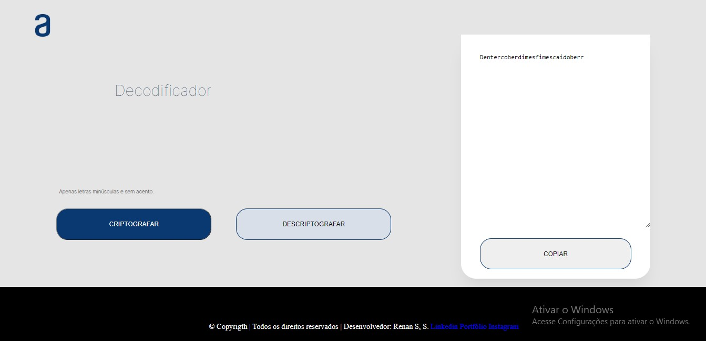

# Decodificador de Texto
Decodificador de texto feito com interações do javascript no html + css. Em outras palavras, desenvolvi um código capaz de capturar as mensagens para criptografar e descriptografar de acordo com um pré-estabelecimento.
Além disso, tentei ao máximo implementar práticas responsivas, com inuito de aumentar a acessibilidade, já que a maior parte dos internautas se encontram em dispositivos mobile.

